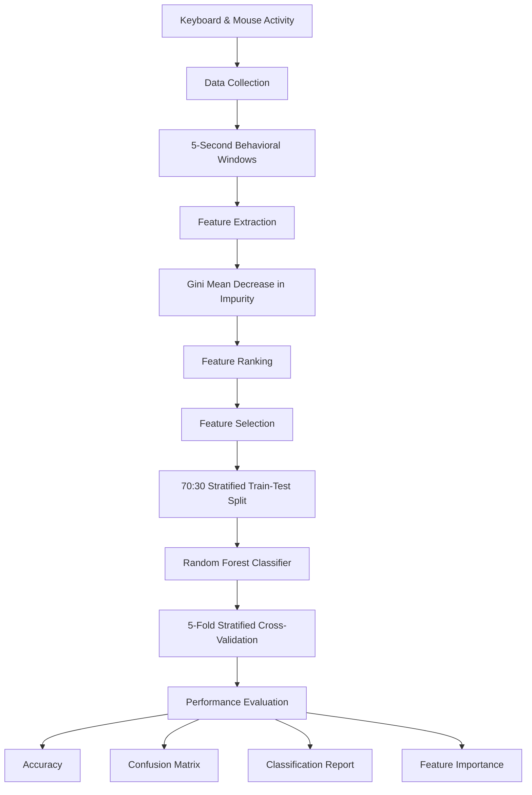
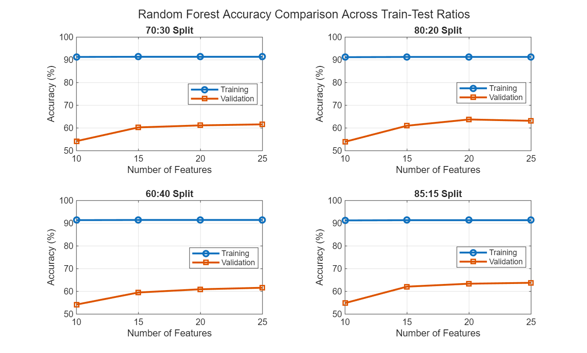
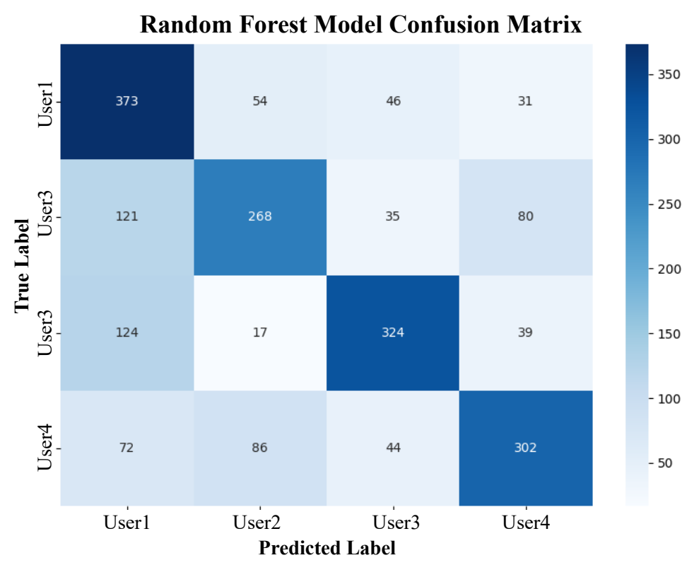

# Continuous User Authentication Using Keyboard and Mouse Behavioral Biometrics

A machine learning-based behavioral biometrics system for user identification and continuous authentication using keyboard and mouse interaction patterns. 

This repository collects behavioral data from users through Python-based monitoring scripts, extracts relevant behavioral features, evaluates feature importance using **Gini Mean Decrease in Impurity**, and applies a **Random Forest Classifier** to distinguish between users based on their interaction behavior.

---

## Research Objective

The primary objective of this project is to investigate whether keyboard and mouse behavioral biometrics can be used with supervised machine learning to distinguish between users continuously. 

Rather than relying solely on traditional static authentication at login, behavioral biometrics offers a passive mechanism for monitoring user identity throughout a computer session. This repository serves as a research prototype exploring data collection, feature importance, classification, and model validation.

---

##  Project Workflow

### 1. Behavioral Data Collection
Python scripts capture keyboard and mouse interactions during active desktop sessions.
* Data is recorded in predefined **behavioral windows**, slicing continuous activity into discrete samples for feature extraction and training.
* Sliced samples are processed to isolate interaction characteristics unique to individual users.

---

### 2. Feature Extraction
Raw interaction events are transformed into structured numerical vectors representing user habits:

| Category | Extracted Behavioral Features |
| :--- | :--- |
| **Mouse Dynamics** | Average position, total movement distance, speed, acceleration, click activity, and click-related timing characteristics. |
| **Keyboard Dynamics** | Key press and release timing, key hold duration, key-to-key timing (flight time), typing rhythm/speed, pause characteristics, and key frequency statistics. |

---

### 3. Feature Importance Analysis
Before final training, feature importance is evaluated using a **Random Forest-based Gini Mean Decrease in Impurity (MDI)** approach. Gini importance measures how much each feature contributes to reducing node impurity across all decision trees.

> **Figure 1:** Gini importance ranking of the selected keyboard and mouse behavioral features.
> 

---

### 4. Train-Test Split
The dataset is split into training and testing subsets using a **70:30 Stratified Split** to ensure equal class proportions across both sets:

Total Dataset
├── 70% Training Set  (Model Fitting & Hyperparameter Tuning)
└── 30% Testing Set   (Holdout Evaluation)

> **Figure 2:** Stratified Train-Test Split Distribution.
> 

---

### 5. Supervised Classification & Model Validation
A **Random Forest Classifier** was trained on the extracted feature set. To assess generalization consistency beyond the holdout set, **5-Fold Stratified Cross-Validation** was performed alongside full performance reporting (Accuracy, Classification Report, Confusion Matrix).

> **Figure 3:** Random Forest classification confusion matrix.
> 

---

## Results

| Metric | Score / Detail |
| :--- | :--- |
| **Test Accuracy** | **62.85%** |
| **Correctly Classified** | 1,267 / 2,016 samples |
| **Validation Strategy** | 5-Fold Stratified Cross-Validation |
